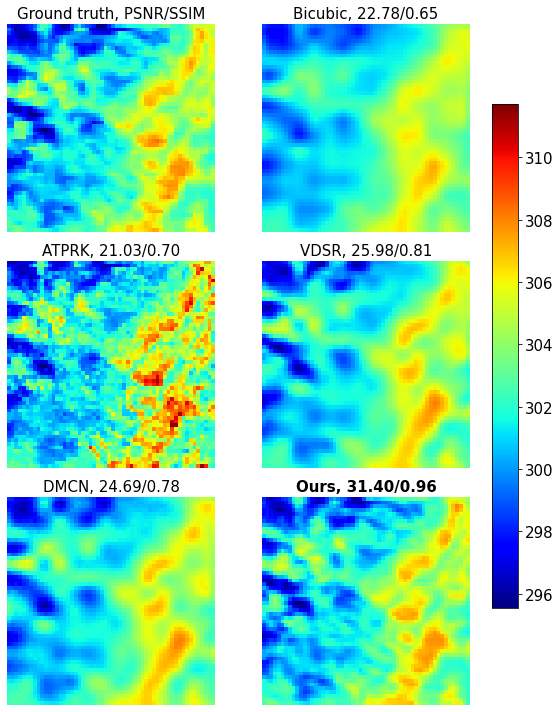

# Convolutional Neural Network Modelling for MODIS Land Surface Temperature Super-Resolution

## 0. Requirements

```
pip install pyModis
pip install pymp-pypi
```

## 1. Data downloading and database preparation
User should firstly register on NASA's website[https://urs.earthdata.nasa.gov/users/new]. 
User could use the following command to download automatically MODIS dataset with the user name and corresponding password, the downloaded data will be placed folder "MODIS" in current directory.
```
python modis_downloader.py --username <username> --password <password> 
```

By assigning values to '--year_begin' and '--year_end', user can select the time range for downloading data, from year_begin to year_end. Default 'year_begin' is 2020, 'year_end' is 2021.
```
python modis_downloader.py --year_begin <year_begin> --year_end <year_end> --username <username> --password <password> 
```

After downloading the raw data for the desired years, data need to be pre-processed, which involves cropping, cloud and sea pixels elimination and downsampling:
```
python modis_data_preprocessing.py --year_begin <year_begin> --year_end <year_end>
```

## 2. Train and test Multi residual U-net

## 3. Result

Qualitative results:



Quantitative results:

| Method                 | PSNR    | SSIM | RMSE |
|:----------------------:|:-------:|:----:|:----:|
|  Bicubic               |  23.91  | 0.61 | 0.69 |
|  ATPRK                 |  21.59  | 0.61 | 0.90 |
|  VDSR                  |  25.42  | 0.72 | 0.58 |
|  DCMN                  |  25.05  | 0.71 | 0.61 |
|  Multi-residual U-Net  |  28.40  | 0.85 | 0.39 | (ours)


# BulidDatabase
Hello guys! For the temporary code/notebook, I hope you can put them in **Dirty_code** folder, and for the **cleaned up** code, you can put it in the root folder directly.

## Metrics
https://cvnote.ddlee.cc/2019/09/12/psnr-ssim-python

## SRCNN
This is the simplest model for super resolution with only 3 layers. The model was trained with 100 epochs and aimed for a scale X2. The inputs have sizes of 256x256, then they are upscaled using bicubic to 512x512 and then fetched into the model (This will be removed in the future)

## SRCNN_64
Use the same network as SRCNN but for the new dataset 64x64 image size.
