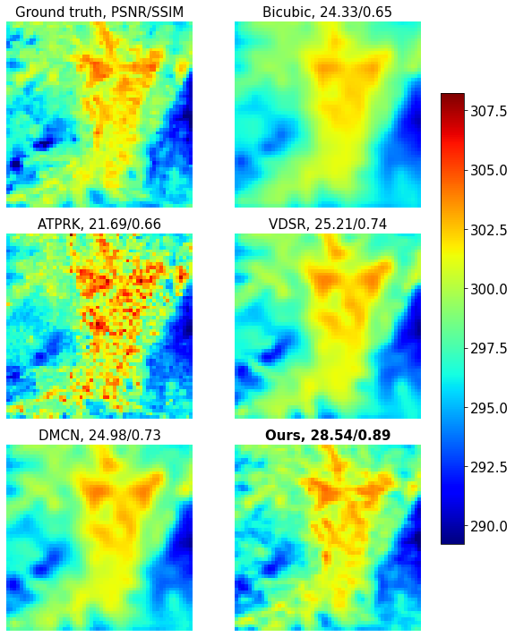

## Benchmark visualization

This folder provides the code to benchmark the methods mentioned in the paper. 

## Requirement
Before running the notebook, you first need to download the pre-trained models and put them in this folder using the following links:

VDSR: https://drive.google.com/file/d/17OKkTVxhD4GSuSArA9bJ6Uq8WkRe1Sb1/view?usp=sharing

DMCN: https://drive.google.com/file/d/12XNOszkNoZTM3aZPwu_LbdLd1HWESwL1/view?usp=sharing

Multi-residual Unet: https://drive.google.com/file/d/1-BCc0-kj07p5FK4GbV_dzLb_0XEuKe6b/view?usp=sharing

You also need to format your dataset into an npy array with the size: 
(data_length, 2, 64, 64).
Where data_length is the number of test data points. Each data points consists of two channels, index 0 represents NDVI and index 1 represents LST. Each channel has the size of 64 x 64 pixels.

The example dataset can be found here: https://drive.google.com/file/d/1np-1OogR8q9coWb-wMdlsFk-Rk6h4ouD/view?usp=sharing.

You need to put your dataset into **dataset** folder.

## Run visualization

After doing previous steps, you can run the notebook visualization_benchmark.ipynb to see the results.

An example result:

